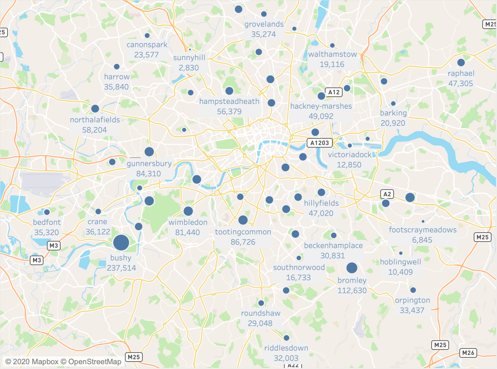

# Data Science Capstone Project - Predicting parkrun results

This project was completed as part of the Data Science Immersive course at General Assembly in December 2020.

## Background

[Parkrun](https://www.parkrun.org.uk/) organise free weekly timed runs, delivered by local volunteers, in 20 different countries globally.  People of all abilities are encouraged to run, walk or jog 5km at their local course with events taking place every Saturday morning.  Results are published online shortly afterwards.  Parkrun started in 2004 and now has 672 locations in the UK alone.  To date over 2.3 million unique participants have crossed the finish line a total of 34.8 million times.  As a keen parkrunner I saw this as a great dataset to explore.

## Goals

Volunteering at parkrun is great fun but most regulars would agree that the job of timekeeper is the most stressful.  The busiest events can have over 2000 participants on a busy day, with most crossing the finishing line in a 45 minute window.  Even with experienced volunteers who are speedy on the stopwatch buttons, sometimes things can and do go wrong.

**Can we train a model to predict finish times and replace the stopwatch?**

1. [Acquire data](#Acquire-Data) - data will be scraped and parsed using Requests and Beautiful Soup
2. [Data Cleaning](#Data-Cleaning) - identify missing or inconsistent data.  Store in a clean format ready for processing.
3. [EDA](#EDA) - explore the data to identify trends and correlations
4. [Modelling](#Modelling) - train a range of regression models, score, cross-validate and test on unseen data.
5. [Evaluate Model](#Evaluate-Model) - Evaluate and assess limitations of best model in practice against stated aim.
6. [Conclusions](#Conclusions)

## Acquire Data

I used the python libraries Requests and Beautiful Soup to scrape and parse results data published online.  Initially I had hoped to collect data from all past events across the UK but soon found that it would be sufficient and more practical to limit the number of events and timescale considered.  When Parkrun started in 2004 there was one event with 13 participants - a great start but certainly an outlier when considering the scale of current events.  I decided to focus on the Greater London area as it has a high density of events, with many runners participating at multiple locations over time, known as Parkrun Tourism!  I hoped that this data would be useful in identifying characteristics of different events and might allow other approaches including clustering and network analysis of running communities at a later stage.

Data acquired:
* 52 event locations in the Greater London Area
* 4 years' event history (14/05/2016 - 14/03/2020, up to 205 events)
* 269,697 unique participants
* 2,694,007 finish time records

The code used for web scraping is included in this notebook - [London Data Collector](london_data_collector.ipynb)

This map shows the locations of the events in Greater London as well as the total number of finishes in my dataset.

## Data Cleaning

Given the size of the dataset I removed repeated text to reduce filesize, storing athlete and event data in separate reference files, linked by Athlete ID and Event Index respectively.  This left the following columns:

event_index (integer) - identifies the event location
event_no (integer) - identifies the numbered instance of the event
date (datetime) - the date of the event
positions (integer) - finish position
athlete_no (integer) - unique participant identifier
total_parkruns (integer) - the total number of times the finisher has participated in a parkrun previously
run_time (integer) - finish time in seconds
event_PB (integer) - previous best time at the event for the individual participant at the same event
in_club (integer) - indicate if the participant is registered with a running club (1) or not (0)
age_groups (string) - category indicating the gender and age group of the participant
age_grades (float) - percentage score measuring the participants time against the best recorded time for their age group.

For more information on Age Grades see - [Parkrun Age Grades](https://support.parkrun.com/hc/en-us/articles/200565263-What-is-age-grading-)

Data cleaning was, as always, a fairly long and iterative process so I will just highlight a few of the challenges that is presented.

* Unknown Runners
Not all participants choose to register with parkrun so that their results are recorded and published online.  These appear in the results tables as "Unknown Runner", occupying a finish position but without any further data, including finish time.  There were a total of 254,545 unknown runners in the dataset.  

